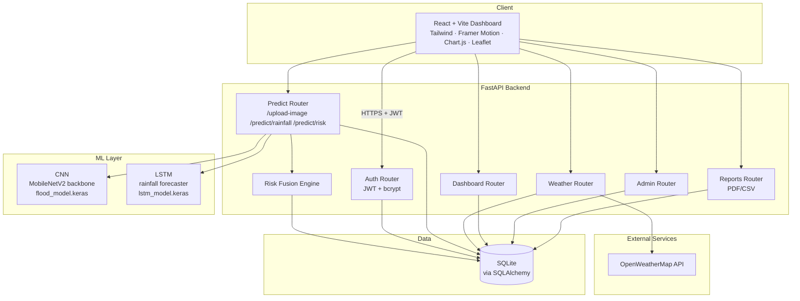
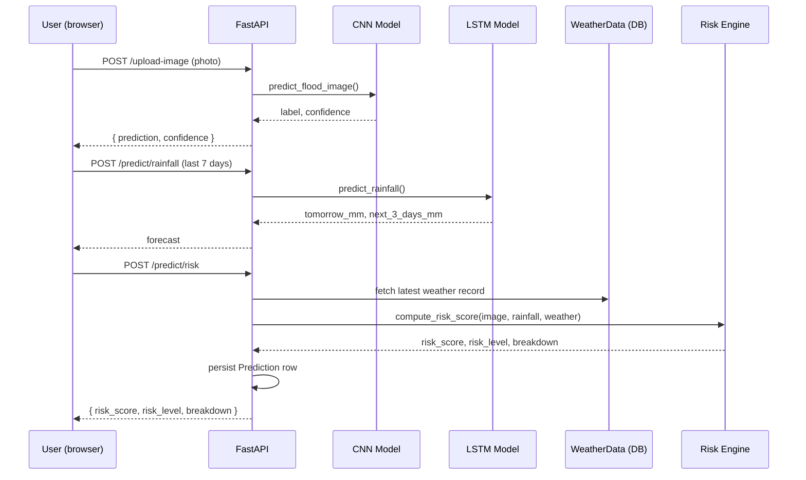
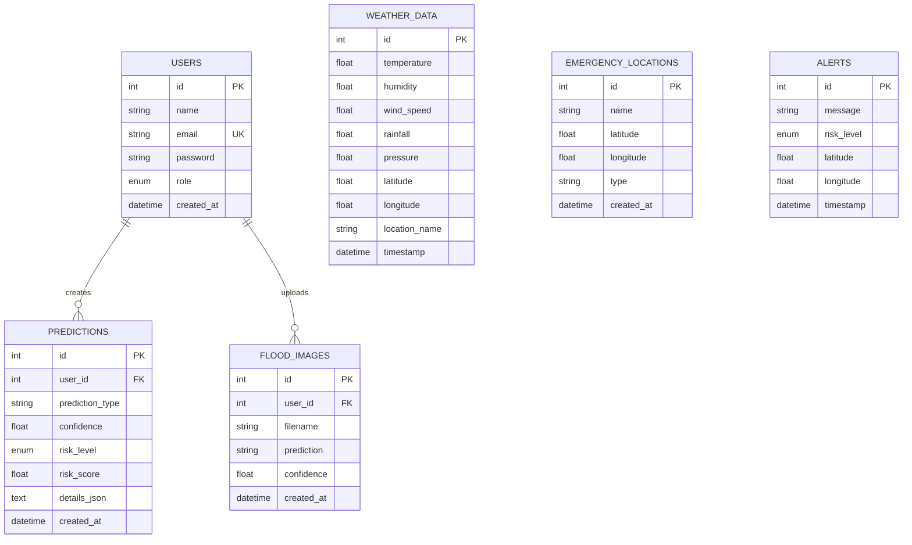

# Architecture

## System Architecture

## Request flow: combined risk prediction

## Entity-Relationship Diagram

## Risk Engine weighting

The fused 0-100 risk score is a weighted blend of three normalized signals:

- **Flood image confidence** — 40% (direct visual evidence)
- **Rainfall forecast** — 35% (predictive signal, mapped via IMD-style intensity bands)
- **Live weather severity** — 25% (humidity, wind speed, pressure drop as a storm indicator)

If a signal is unavailable (e.g. no image uploaded yet), its weight is
excluded and the remaining weights are renormalized — so the score stays
meaningful with partial data rather than defaulting to zero.

## Why these tech choices

- **MobileNetV2 transfer learning** for the CNN: trains fast and performs
  reasonably even on modest dataset sizes — appropriate for a student project
  timeline without a GPU cluster.
- **LSTM over a simple moving average**: rainfall has temporal dependencies
  (wet/dry spells cluster), which recurrent networks capture better than
  naive statistical baselines.
- **SQLite**: zero-config, file-based, sufficient for a single-instance
  academic deployment; the SQLAlchemy layer makes swapping to Postgres a
  one-line `DATABASE_URL` change if scaling is ever needed.
